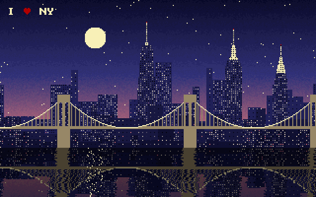

# NYC by Night



A 512-byte x86 boot sector that draws New York at night and keeps it alive.
You get the Brooklyn Bridge, One World Trade Center, the Empire State and
Chrysler buildings, a procedural skyline, the moon and stars, and the East
River reflecting it all. Windows flicker, the water ripples, moonlight
glitters, and the spire beacons pulse in time with the ♥.

## Run

```sh
qemu-system-i386 -drive format=raw,file=nyc.bin
```

## Build

```sh
nasm -f bin nyc.asm -o nyc.bin
```

`nyc.asm` is commented throughout and explains how it all fits in 510 bytes.
